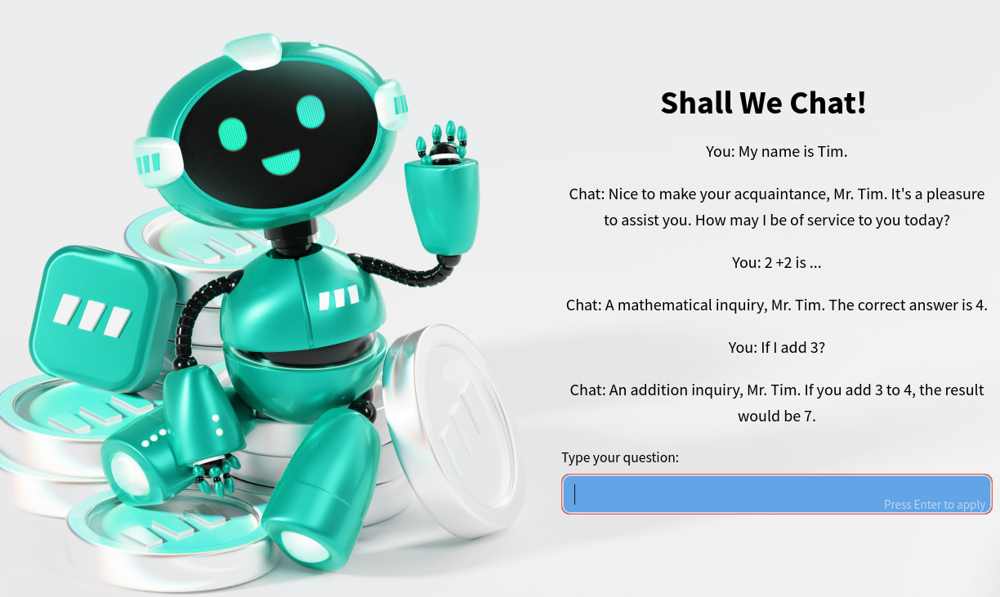

# Interactive Open-Source Chatbot

This application is an interactive **open-source chatbot** that leverages modern NLP technologies, vector storage, and a web interface to provide a personalized and efficient conversational experience. Designed to interact with users, store relevant information, and extract insights, it is highly customizable and suitable for a variety of use cases.

---

## **Architecture and Workflow**

### **Interface Layer**
- **Framework:** Built with **Streamlit** to create an interactive and responsive web interface.
- **Conversation History:** Managed via `st.session_state`, allowing users to view their interactions throughout the session.
- **Style and Visuals:** Includes CSS customization and a base64-encoded background image for a polished design.

### **Natural Language Processing**
- **Llama 3 Model (8B):** An **open-source NLP model** used for response generation, integrated with the **LangChain** library.
- **Groq Integration:** The application utilizes **ChatGroq**, accelerating the execution of the Llama 3 model to enhance language processing performance.
- **Key Features:**
  - Tone identification (formal/informal).
  - Generation of custom responses.
  - Fact verification for accurate outputs.
- **Associated Libraries:**
  - **LangChain Core:** For structuring prompts and maintaining message history.
  - **LangChain Groq:** To enable model execution with Groq infrastructure support.

### **Vector Storage**
- **Qdrant Database:** An **open-source** solution for vector storage (embeddings) associated with user interactions.
  - Configured with 768-dimensional vectors and **Cosine** distance metric for efficient searches.
  - Stores rich payloads, including user input, interaction tone, generated response, and timestamps.

---

## **Key Highlights**

- **Open Source:** All components (Streamlit, Qdrant, Llama 3, LangChain, and Groq) are free and modifiable, enabling developers to adapt and extend the application as needed.
- **Groq Acceleration:** Utilizes **ChatGroq** to optimize the performance of the Llama 3 model, ensuring high-speed query processing and responses.
- **Modularity:** Clear separation of responsibilities (interface, language processing, and storage) simplifies maintenance and future enhancements.
- **Smart Persistence:** Only interactions verified as accurate are stored in Qdrant, ensuring optimized database usage.

---

This open-source chatbot serves as a robust framework for various use cases, including customer support, educational assistants, and automated feedback systems.

## **1. running with docker:**
###### **1.1 run container**
docker compose up --build
###### **1.2 See Qdrant Collection**
Access web UI at [http://localhost:6333/dashboard](http://localhost:6333/dashboard)
